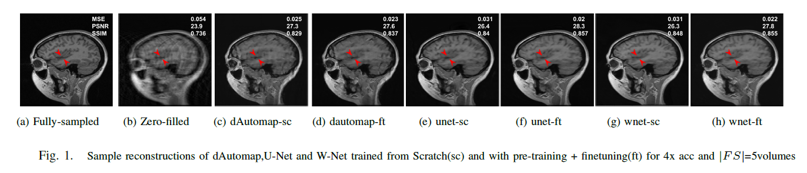
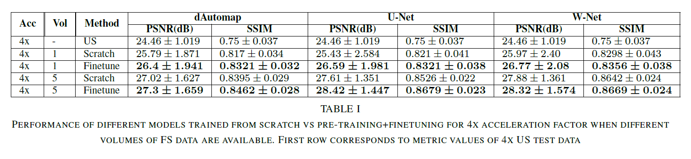
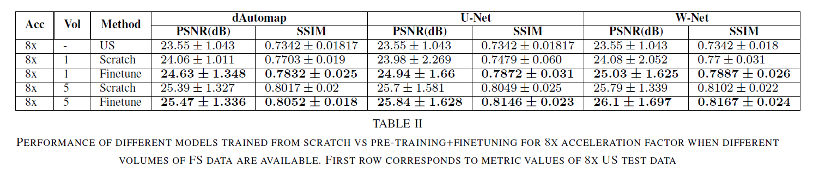
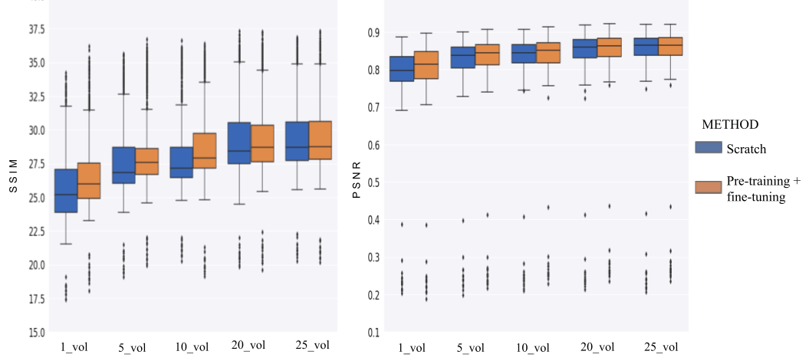
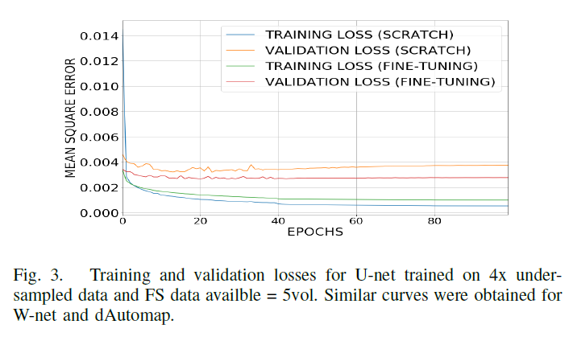

# Self-supervision based Deep Learning for Fast MRI Reconstruction
This repository provides the official Pytorch code for our paper titled: "**Improving Fast MRI Reconstructions with Pretext Learning in Low-Data Regime**"
 
 
The paper got accepted in IEEE 44th Annual International Conference of the IEEE Engineering in Medicine and Biology Society (EMBC-2022) held at Glasgow, Scotland, UK.
 

* In this paper, we exploit the Self Supervision based learning by introducing an Auto-encoder based pretext method to boost feature learning using the more commonly available under-sampled MR data.
* Our experiments using different deep-learning-based reconstruction models (dAutomap, U-net, W-net) in a low data regime demonstrate that self-supervision ensures stable training and improves MR image reconstruction.

## Experients

### dataset
The Brain MRI data is collected from [Calgary-Campinas Public Brain MR Datasest](https://sites.google.com/view/calgary-campinas-dataset/home). 

### results
### acceleration = 4x

### acceleration = 8x

### performance improvement

### training and validation curves

